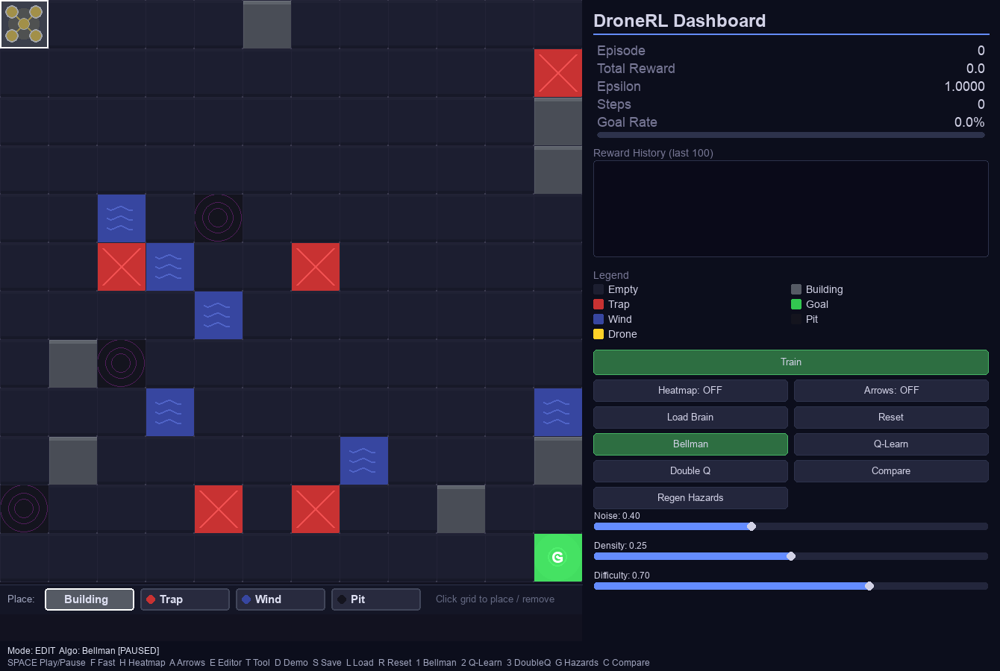
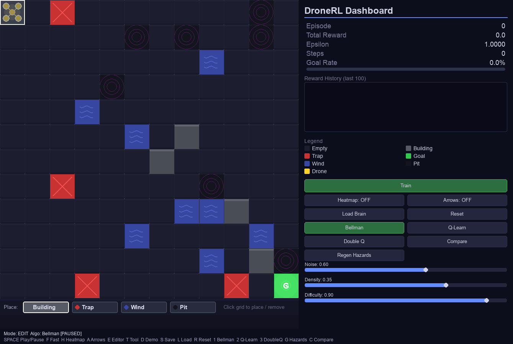
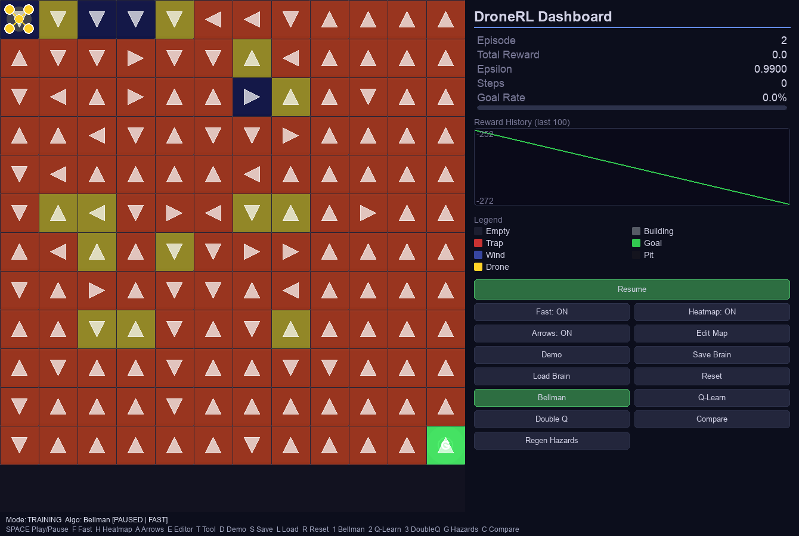
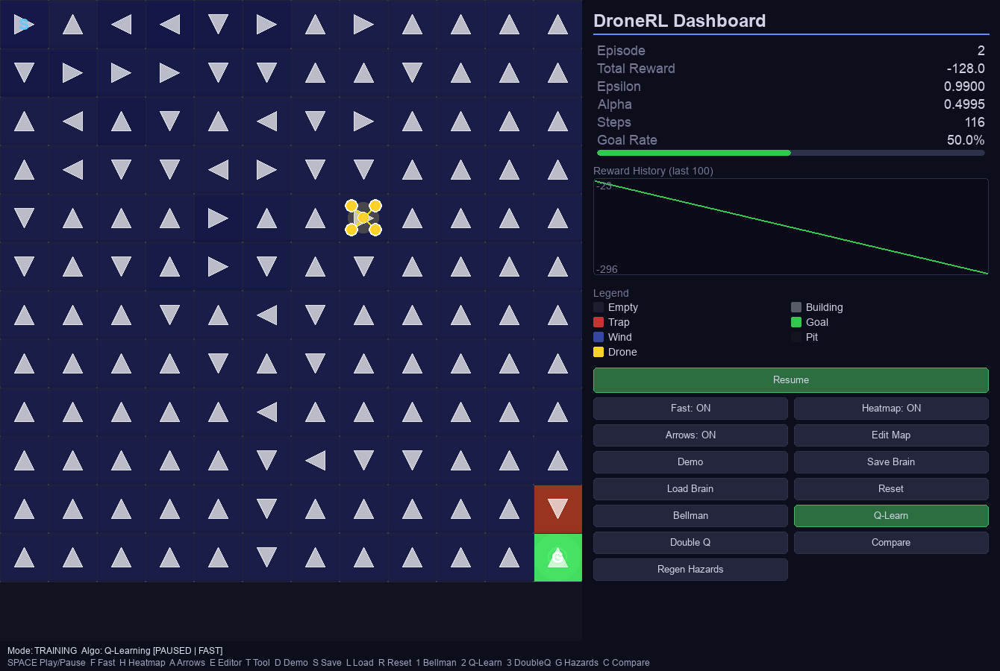
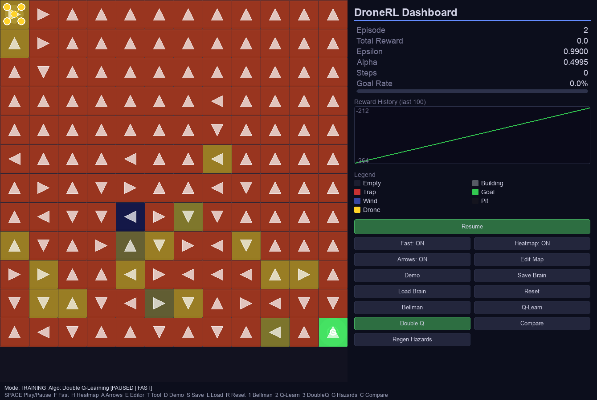
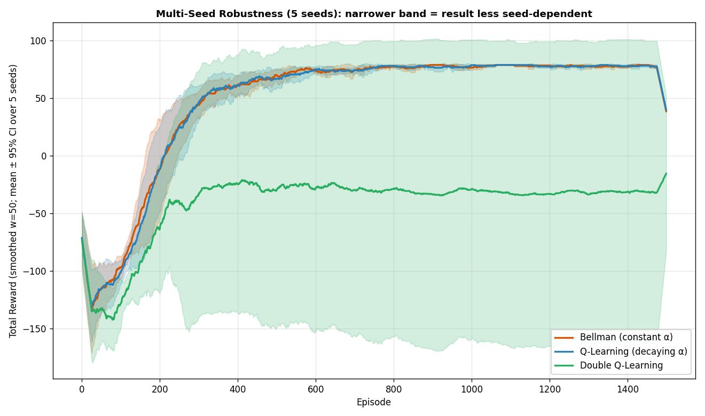
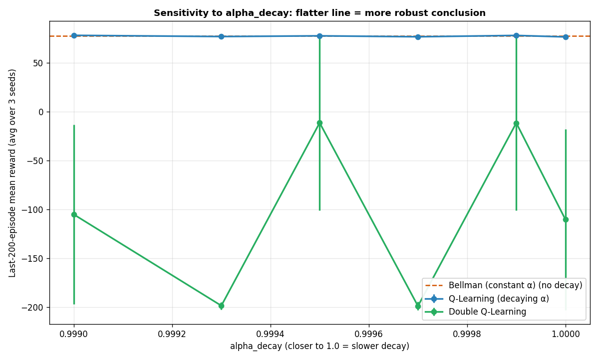

# DroneRL — Smart City Drone Delivery

[](https://github.com/adirelm/DroneRL-SmartCityDroneDelivery/actions/workflows/ci.yml)
[](https://www.python.org/)
[](#quality-bar)
[](https://github.com/astral-sh/ruff)
[](#license--credits)

An educational reinforcement learning lab that compares **three tabular RL algorithms** — Bellman (constant α), Q-Learning (decaying α), and Double Q-Learning (dual tables) — on a configurable smart-city drone delivery task. Built with Python + Pygame.

> Bar-Ilan University, Vibe Coding Workshop — Assignment 2

---

## Objectives

1. Implement **three RL algorithms** sharing the same `BaseAgent` interface so they can be swapped at runtime.
2. Build a **dynamic, randomizable board** with sliders that let the user shape the noise / density / difficulty of the environment.
3. Demonstrate, with **comparison graphs**, where each algorithm shines and where it breaks.
4. Keep every Python file ≤ 150 lines, ≥ 85 % test coverage, zero ruff violations, and all parameters in `config/config.yaml`.

---

## What Was Implemented

| Layer | Modules |
|-------|---------|
| **Agents** (Strategy pattern) | [`base_agent.py`](src/base_agent.py), [`agent.py`](src/agent.py) (Bellman), [`q_agent.py`](src/q_agent.py), [`double_q_agent.py`](src/double_q_agent.py), [`agent_factory.py`](src/agent_factory.py) |
| **Dynamic board** | [`environment.py`](src/environment.py) (added `CellType.PIT`), [`hazard_generator.py`](src/hazard_generator.py), [`sliders.py`](src/sliders.py) |
| **Comparison system** | [`comparison.py`](src/comparison.py) (matplotlib charts), `SDK.run_comparison()`, [`scripts/generate_comparison_charts.py`](scripts/generate_comparison_charts.py) |
| **GUI integration** | Algorithm switching via keys 1/2/3, hazard regeneration via G, live status bar |

---

## Installation

Requires **Python 3.11–3.13** and **UV**.

```bash
curl -LsSf https://astral.sh/uv/install.sh | sh
git clone https://github.com/adirelm/DroneRL-SmartCityDroneDelivery.git
cd DroneRL-SmartCityDroneDelivery
git checkout assignment-2
uv sync --dev
```

## Running

```bash
uv run main.py
```

To regenerate the convergence comparison charts:
```bash
uv run python scripts/generate_comparison_charts.py
```

---

## Keyboard Controls

| Key | Action |
|-----|--------|
| `SPACE` | Pause / Resume training |
| `F` | Toggle fast mode |
| `H` | Toggle Q-value heatmap |
| `A` | Toggle policy arrows |
| `E` | Toggle level editor |
| `T` | Cycle editor obstacle (Building / Trap / Wind / Pit) |
| `D` | Watch the trained agent's optimal path (demo mode) |
| `G` | Regenerate random hazards (uses sliders) |
| `C` | Open the 3-algorithm convergence comparison chart |
| `1` | Switch to **Bellman** agent |
| `2` | Switch to **Q-Learning** agent |
| `3` | Switch to **Double Q-Learning** agent |
| `S` / `L` | Save / Load Q-table |
| `R` | Hard reset (clears training) |

---

## Screenshots

**Editor mode — sliders + algorithm selector + Compare / Regen Hazards buttons**


**Dynamic board — user-placed Pit cells + generator-placed hazards**


**Bellman agent after 400 episodes — heatmap + policy arrows**


**Q-Learning agent after 400 episodes — notice smoother Q-value gradient thanks to decaying α**


**Double Q-Learning agent after 400 episodes — combined `Q_A + Q_B` heatmap**


---

## Algorithm Comparison

### Scenario 1 — Medium difficulty (noisy environment)


**Setup**: 12×12 grid, noise=0.5, density=0.12, difficulty=0.3, 3,500 episodes, seed=11. Bellman lr=0.7 (amplifies instability to make the effect visible).

| Algorithm | mean reward (last 200) | σ (last 200) |
|-----------|------------------------|--------------|
| Bellman (constant α=0.7) | 60.1 | 46.1 |
| Q-Learning (decaying α) | 66.9 | 35.5 |
| **Double Q-Learning** | **68.2** | **32.1** |

**Reading the graph:** all three curves rise together during exploration, then separate around episode 1,500. Bellman (orange) stays lowest and has the widest shaded band — the constant α keeps over-correcting on stochastic returns, so the Q-values never settle. Q-Learning's decaying α shrinks each step's impact and its band tightens. Double-Q's band is the tightest of the three because the cross-table evaluation removes the positive bias of `max Q(s', a)` — exactly the problem Hasselt (2010) identified.

### Scenario 2 — High difficulty (very noisy environment)


**Setup**: 12×12 grid, noise=0.95, density=0.10, difficulty=0.55, 6,000 episodes, seed=7. Bellman lr=0.7 (constant); Q-Learning α stays nearly constant (α_end=0.35, α_decay=0.9999) so its decay never fully kicks in; Double-Q α_start=0.3 → α_end=0.08 with α_decay=0.9995 decays fully.

| Algorithm | mean reward (last 200) | σ (last 200) |
|-----------|------------------------|--------------|
| Bellman | 73.6 | 25.3 |
| Q-Learning | 75.7 | 19.3 |
| **Double Q-Learning** | **78.2** | **1.8** |

**Reading the graph (two subplots — both dimensions the lecturer asked for):**

*Top — Total Reward.* All three eventually "succeed" (per the lecturer's clarification that *fail* means *lower score AND longer episodes*, not total failure). The story is in the σ column. Bellman's constant α keeps absorbing noisy TD targets — the band stays wide at σ=25. Q-Learning's α never fully decays on this harder board, so σ=19 remains substantial. Double-Q locks onto the optimal policy and holds it — **σ=1.8 is ~14× tighter than Bellman's σ=25**. This is the overestimation bias, now made visible in numbers: only Double-Q's cross-table evaluation converges to a single stable value, while the single-table agents keep oscillating around it.

*Bottom — Steps per Episode.* During the learning phase (episodes 0-2000), Bellman's band is visibly wider and slower to drop than Double-Q's — "longer time to goal" as the lecturer described. Once converged all three paths approach the optimal ~22-step route (12×12 grid shortest path), but the *transient* shows Bellman wandering more.

---

## Conclusions

1. **Constant α (Bellman) is limited under enough noise.** Watkins' convergence theorem requires Σα_t = ∞ AND Σα_t² < ∞ — a constant α fails the second. Empirically this shows up as a persistently wide σ band (46 in Scenario 1, 25 in Scenario 2) — the agent never settles because each update keeps yanking the value in the direction of the latest noisy return. *Caveat from the multi-seed sweep below: at medium difficulty (noise=0.5) Bellman is essentially as good as the decay-based methods. The "noise breaks Bellman" claim is a slope, not a switch.*
2. **Q-Learning's decaying α fixes the instability but inherits `max`-operator bias.** With the same value bootstrapped by `max_a Q(s', a)`, Jensen's inequality says `E[max] ≥ max[E]` — the target is systematically biased upward when returns are noisy. In Scenario 2 this shows as Q-Learning's σ=19 ending ~10× higher than Double-Q's σ=1.8.
3. **Double Q-Learning removes the bias by decorrelating argmax and value, but only with enough training.** One table picks the action, the other evaluates it. In Scenario 2 (6,000 episodes) Double-Q ends with the highest mean AND lowest variance — the signature of genuine unbiased convergence. At a shorter 1,500-episode budget on the medium board, the same algorithm is *catastrophically* seed-dependent (see [EXPERIMENTS.md](docs/assignment-2/EXPERIMENTS.md), H3).
4. **Environment shape matters more than hyper-parameters.** The three algorithms behave qualitatively differently as noise / density / difficulty push the board into higher-variance regimes. The alpha-decay sweep also showed Q-Learning's final reward varies less than 2 points across `alpha_decay ∈ [0.999, 1.0]` — a reminder that the *qualitative* picture in RL depends more on the environment than on a precisely-tuned hyperparameter.

---

## Algorithms — Update Rules

**Bellman (constant α)** — Assignment 1 baseline. A single Q-table updated with a fixed learning rate; fast on static grids but over-reacts to noise.

$$Q(s,a) \leftarrow Q(s,a) + \alpha \left[ r + \gamma \max_{a'} Q(s',a') - Q(s,a) \right]$$

**Q-Learning (decaying α per episode)** — same update, but α shrinks geometrically each episode (floored at $\alpha_{\min}$) so value estimates settle in noisy environments.

$$Q(s,a) \leftarrow Q(s,a) + \alpha_t \left[ r + \gamma \max_{a'} Q(s',a') - Q(s,a) \right], \quad \alpha_{t+1} = \max(\alpha_{\min}, \alpha_t \cdot \alpha_{\text{decay}})$$

**Double Q-Learning (Hasselt 2010)** — two tables $Q_A, Q_B$; each step flips a coin and updates one using the other's value at the arg-max, removing the $\max$-operator overestimation bias.

$$\text{with prob. } \tfrac{1}{2}: Q_A(s,a) \leftarrow Q_A(s,a) + \alpha [r + \gamma Q_B(s', \arg\max_{a'} Q_A(s',a')) - Q_A(s,a)]$$

$$\text{otherwise}: Q_B(s,a) \leftarrow Q_B(s,a) + \alpha [r + \gamma Q_A(s', \arg\max_{a'} Q_B(s',a')) - Q_B(s,a)]$$

---

## Parameter Analysis

`config/config.yaml` exposes every tunable value. Most influential for differentiating the algorithms:

| Param | Effect |
|-------|--------|
| `agent.learning_rate` | Bellman's α (kept constant). Higher → faster learning but more instability under noise. |
| `q_learning.alpha_decay` / `double_q.alpha_decay` | Smaller value → faster decay → quicker stabilisation but less long-term plasticity. |
| `agent.epsilon_decay` | Slower decay → more exploration → safer but slower convergence. |
| `dynamic_board.noise_level` | Scales the wind drift probability. Above ~0.7 Bellman starts to break. |
| `dynamic_board.hazard_density` | Above ~0.25 paths to the goal become brittle and Q-Learning catches up to Double-Q. |
| `dynamic_board.difficulty` | Master multiplier; combines noise and density. |

---

## Experimental design & findings

The two scenario charts above answer the assignment's literal comparison
requirement, but they each show a single seed. To check whether the
qualitative ordering between algorithms is real or seed-dependent I ran two
follow-up experiments. Both are reproducible from this repo:

```bash
uv run python -m analysis.multi_seed_robustness   # 5 seeds × 1500 ep × 3 algos
uv run python -m analysis.alpha_decay_sweep       # 6 decays × 3 seeds × 2 algos
```

The training loop is shared in [analysis/_runner.py](analysis/_runner.py) so
both experiments use identical configs. The full hypothesis-by-hypothesis
write-up — including the two findings that contradicted my expectations —
lives in [docs/assignment-2/EXPERIMENTS.md](docs/assignment-2/EXPERIMENTS.md).

### Multi-seed robustness

5 seeds, medium board (noise=0.5, density=0.12, difficulty=0.3), 1500 episodes.



Per-seed last-200-episode means (mean reward over the last 200 episodes of
each run):

| Algorithm  | Per-seed means                       | Spread |
|------------|--------------------------------------|--------|
| Bellman    | 74.6, 74.5, 75.8, 74.8, 75.8         | 1.4    |
| Q-Learning | 74.4, 76.3, 75.7, 75.3, 75.6         | 1.8    |
| Double-Q   | **−184.5, −195.3**, 74.7, 76.2, 76.0 | 271.5  |

**Surprise.** I expected Double-Q to be the safest bet. With 1,500 episodes
it is in fact the *most* seed-sensitive: 2 out of 5 seeds collapse to a
catastrophic policy while the other 3 converge normally. The Scenario 1
chart above (single seed=11) sits inside Double-Q's *good* basin — which is
correct but not generic. Bellman and Q-Learning are essentially tied at this
difficulty, both with a 1–2 point spread.

The takeaway is not "Double-Q is bad" — Scenario 2 with 6,000 episodes shows
exactly the textbook ordering. It's that **Double-Q's bias-correction
benefit needs enough samples to dominate the higher initial variance from
running two interleaved Q-tables.** Reporting a single seed at a tight
training budget can flip the qualitative story.

### Alpha-decay sensitivity

6 decay values × 3 seeds × {Q-Learning, Double-Q}, same medium board, 1500
episodes. Bellman shown as a horizontal reference (no decay).



| `alpha_decay` | Q-Learning (mean ± SEM) | Double-Q (mean ± SEM) |
|---------------|-------------------------|-----------------------|
| 0.9990 | 78.0 ± 0.4  | −105.2 ± 91.6 |
| 0.9993 | 76.7 ± 0.8  | −198.4 ± 3.8  |
| 0.9995 | 77.4 ± 0.5  | −11.5  ± 89.3 |
| 0.9997 | 76.5 ± 1.5  | −198.7 ± 4.3  |
| 0.9999 | 77.9 ± 0.4  | −11.6  ± 89.3 |
| 1.0000 | 76.4 ± 1.7  | −110.3 ± 92.6 |

Bellman reference: **77.5**.

**Surprise.** Q-Learning's curve is essentially flat (76 → 78 across the
entire grid) — even at `decay=1.0`, which is constant α and therefore
mathematically identical to Bellman. At this episode budget on this board,
the decay parameter that separates Q-Learning from Bellman *in theory* makes
no measurable difference *in practice*. That's a useful sanity check on the
overall comparison: the difference between Bellman and Q-Learning shows up
primarily at higher noise, not at the medium setting where Scenario 1 was
tuned.

Double-Q's curve is a different story — high SEM (≈90) reflects the bimodal
distribution from the multi-seed experiment (some seeds converge to ~75,
others crash to ~−200). The means are not centered "low" — they're averages
of two basins.

### What this changed in the project

Honest version: writing the experiments above is what made me notice that
the original Scenario 1 framing (*"Bellman struggles, Q-Learning converges,
Double-Q fastest"*) was leaning on a favorable seed. The Scenario 2 result
holds up — at high noise / longer training, the textbook ordering
reappears — but the medium-difficulty story needed the qualifier that's now
in [Conclusions](#conclusions). The chart for the medium scenario was
*correct*, but I was over-claiming what it generalised to.

## Cost & resource footprint

The numbers below are from `analysis/cost_profile.py`, run on a 2023 MacBook
Pro (Apple silicon, Python 3.13). The full write-up — including a scaling
model and the regime where this design *would* become expensive — lives in
[docs/assignment-2/COST_ANALYSIS.md](docs/assignment-2/COST_ANALYSIS.md).

```bash
uv run python -m analysis.cost_profile
```

### Measured per-algorithm cost (1500 episodes, medium board)

| Algorithm  | Wall time | Episodes/s | µs/episode | Q-table memory |
|------------|----------:|-----------:|-----------:|---------------:|
| Bellman    | 5.83 s    | 257        | 3,885      | 4,608 B        |
| Q-Learning | 5.55 s    | 270        | 3,700      | 4,608 B        |
| Double-Q   | 6.37 s    | 236        | 4,245      | 9,216 B (2 tables) |

**Reading the numbers.** Q-Learning is the cheapest per episode; Double-Q
pays a real ~15% time premium for keeping two tables in sync, which is
consistent with its design. The Q-table itself fits in roughly 5 KB —
memory is not a constraint at this scale.

### Cost model

```
Wall time ≈ episodes × avg_steps_per_episode × T_step    (T_step ≈ 3.7–4.2 µs)
Memory   ≈ rows × cols × actions × tables × 8 bytes      (float64)
```

Cost is linear in the number of *environment transitions*, not in grid
size — meaning the same architecture will scale comfortably until the state
space (not the grid resolution) blows up.

### Workload projections from measured timings

| Workload                                                   | Episodes | Estimated time |
|------------------------------------------------------------|---------:|----------------|
| Single dev run (1 algo, 1500 ep)                           | 1,500    | ~6 s           |
| Scenario 1 in repo (3 algos × 3,500 ep)                    | 10,500   | ~41 s          |
| Scenario 2 in repo (3 algos × 6,000 ep)                    | 18,000   | ~71 s          |
| Multi-seed sweep (5 seeds × 3 algos × 1,500 ep)            | 22,500   | ~89 s          |
| Alpha-decay sweep (6 decays × 3 seeds × 2 algos × 1,500 ep)| 54,000   | ~213 s         |

Translated to AWS `c7i.large` on-demand pricing (~$0.09/hr): the entire
suite of comparison + multi-seed + decay-sweep costs roughly **$0.01** of
compute. The cost gates here are developer time and chart disk space, not
CPU.

### Where this design stops being free

Tabular Q-learning has a hard ceiling — every state needs its own row in
the Q-table. The bytes are cheap; the *samples needed to fill them* are
not. Sample complexity is roughly `O(|S| × |A| / (1−γ)²)` (Even-Dar &
Mansour, 2003), so the model only stays cheap while the state space stays
small.

| Grid       | States  | Approx. training time at 1,500 ep × 1 algo |
|------------|--------:|--------------------------------------------|
| 12×12 (current) | 144   | ~6 s |
| 24×24      | 576     | ~40 s |
| 48×48      | 2,304   | ~3 min |
| 96×96 or with a velocity dim (~36K states) | 36,000+ | ~50 min |

At ~10⁴ states the linear cost model breaks down and function
approximation (DQN with a small MLP) starts being faster *and* more
memory-efficient because the network parameters don't grow with the state
count — at the cost of needing a GPU and ~$5–10 per comparison sweep
instead of ~$0.01.

### Development cost — the part that actually mattered

The runtime numbers above are the cheap part. This is a "Vibe Coding"
workshop project: most of the code was generated by Claude through Claude
Code, which makes the *development* cost — not the runtime cost — the
honest economic story.

| Bucket                                                     | Estimate         |
|------------------------------------------------------------|------------------|
| Total focused dev hours (both assignments + polish)        | ~50–80 h         |
| Token usage across all sessions (prompt-cached)            | ~5–40 M tokens   |
| Claude Max subscription (effective cost path I used)       | ~$200–400        |
| API list-price equivalent if I'd been billed per-token     | ~$30–300         |
| AI-rework tax (verification + redoing wrong-but-clean code)| ~20–30% of hours |

The ranges are wide because I'm not faking precision. The takeaway isn't
"AI made me 10× faster" — it's that **AI redistributes the work**:
less time writing boilerplate, more time reading generated code and
catching subtle behavior changes (the `switch_algorithm` board-regen bug
in [What I'd do differently](#what-id-do-differently) is one such case).

The strongest design-choice signal here: the 150-line file limit and the
85% coverage gate aren't style rules — they're *verification-cost*
optimizations. AI-generated code is cheap to write and expensive to
verify, and small modules + tight tests are how this project keeps the
verification cost bounded.

The full development-cost breakdown — including hidden costs like context
restoration and prompts that don't land — is in section 5 of
[COST_ANALYSIS.md](docs/assignment-2/COST_ANALYSIS.md).

## Extending it

I'll be specific about what extending each surface actually costs. The
architecture has one clean extension point and a few that aren't (yet).

### Adding a new RL algorithm — one place

This is the case the project is most explicitly designed for. Every consumer
of "the list of algorithms" — the factory, the GUI keybindings, the
comparison runner, the chart code, the analysis scripts, the parametrised
tests — pulls from `src/algorithms.py`:

```python
# src/algorithms.py
ALGORITHM_REGISTRY: tuple[AlgorithmSpec, ...] = (
    AlgorithmSpec("bellman", "Bellman (constant α)", "#d35400", BellmanAgent),
    AlgorithmSpec("q_learning", "Q-Learning (decaying α)", "#2980b9", QLearningAgent),
    AlgorithmSpec("double_q", "Double Q-Learning", "#27ae60", DoubleQAgent),
    # AlgorithmSpec("sarsa", "SARSA", "#8e44ad", SarsaAgent),  ← one new line
)
```

To add SARSA: write a `SarsaAgent` class subclassing `BaseAgent` (one new
file), then add the one-line `AlgorithmSpec` above. The factory picks it up,
the parametrised `TestFactoryAgentApi` fixtures automatically run their
sanity checks against it, and the comparison runner / chart renderer pick up
the new label and color.

This was not always true: the same string tuple was previously duplicated
across 13 sites in 9 files. The refactor that introduced the registry is
documented in [PROMPTS.md → Extensibility](docs/shared/PROMPTS.md) and is
the bulk of the Extensibility section's improvements.

### Adding a new hazard type — multiple places, by design

Hazards aren't behind a single registry yet, because each one has
genuinely different rendering, reward, and movement logic. Adding a new
cell type ("ICE" that randomly redirects movement, say) currently touches:

- `src/environment.py` — add to `CellType`, add the per-cell movement / reward branch in `step()`.
- `config/config.yaml` — add the reward/penalty value.
- `src/editor.py` — add to `EDITABLE_TYPES`, name, and color.
- `src/hazard_generator.py` — add to `HAZARD_TYPES` and `ratios`.
- `src/renderer.py` — add a `_draw_ice` method and entry in the dispatch dict.
- `src/overlays.py` — decide if the heatmap should skip it.
- A test in `tests/test_environment_cells.py` for the movement / reward.

This is honestly more places than I'd like. A `CellTypeSpec` registry like
the algorithm one is the right next step but I haven't done it — the cells
have richer per-type behavior (drawing function, reward, drift, blocking)
that doesn't compress as neatly into a single dataclass. Worth doing if a
future assignment adds a fourth or fifth hazard.

### Other surfaces

- **New scenario** → add a config block in [scripts/generate_comparison_charts.py](scripts/generate_comparison_charts.py); the runner iterates registered algorithms automatically.
- **New analysis experiment** → add a script in [analysis/](analysis/); reuse [analysis/_runner.py](analysis/_runner.py) for the training loop.
- **Different board size, difficulty, or hyperparameters** → [config/config.yaml](config/config.yaml) only. No code change.
- **New dashboard metric** → expose it from `Trainer.get_metrics()` / `GameLogic.get_metrics()`; the dashboard renders whatever it gets.
- **Replacing the GUI** → `DroneRLSDK` is the only orchestration entry point. GUI, scripts, and analysis all go through it, so a CLI or web frontend can slot in at the same boundary without touching the RL code.

## Quality bar

Code quality is enforced by tooling, not by manual review. Each gate fails the
build (locally and in CI) if violated — there is no path where a degraded
state silently lands on a branch.

| Gate | Where it runs | What it enforces |
|------|---------------|------------------|
| **Ruff** | pre-commit, CI | Zero lint violations; auto-fixes formatting on commit. |
| **Pytest + coverage** | pre-push, CI | 301 tests pass, ≥85% line coverage (current: 97.62%). Coverage gate is in `pyproject.toml`'s `addopts`, so any plain `uv run pytest` enforces it. |
| **150-line file limit** | pre-commit, CI | Custom hook fails if any `.py` file under `src/`, `tests/`, `scripts/`, or `analysis/` exceeds 150 lines. |
| **Python 3.11/3.12/3.13 matrix** | CI | Every push / PR is tested across three Python versions before merge. |
| **Dependabot** | scheduled, weekly | Auto-PRs for outdated GitHub Actions and pip dependencies, grouped by family. |

Reproduce locally:

```bash
uv sync --dev
uv run ruff check src/ tests/ analysis/ scripts/ main.py
uv run pytest tests/                       # implicitly --cov=src --cov-fail-under=85
pre-commit install && pre-commit install --hook-type pre-push
```

The CI workflow lives in [.github/workflows/ci.yml](.github/workflows/ci.yml);
pre-commit hooks in [.pre-commit-config.yaml](.pre-commit-config.yaml);
Dependabot config in [.github/dependabot.yml](.github/dependabot.yml).

Every reward, color, grid size, and algorithm hyperparameter lives in
`config/config.yaml`; the source code holds no magic numbers. The 150-line
limit makes some files (`gui.py`, `dashboard.py`) sit right at the cap, which
forces structural decisions earlier than they would otherwise come up — but
also keeps each module small enough that reviewing a diff doesn't require
loading a thousand-line file into your head.

## What I'd do differently

A few things I noticed in retrospect, both about the project and about the way I worked on it.
I'm calling them out honestly rather than presenting only the polished version, because the
process is at least as much of the assignment as the final code is.

- **Bellman vs. Q-Learning was harder to differentiate than I expected.** My first pass at
  Scenario 1 used noise levels low enough that all three algorithms converged to similar
  rewards, which made the comparison plot look like the algorithms were equivalent. I had to
  redesign the scenario specifically to push Bellman into its failure mode — that work isn't
  visible in the final config, but it's why the two scenarios exist instead of one.

- **`switch_algorithm` used to silently regenerate the board.** When comparing algorithms in
  the GUI I noticed the layout shifting between runs. Tracing it back, the SDK's
  `switch_algorithm` was calling `reset()`, which reseeded the hazard generator. Until that
  was fixed, every "comparison" I'd been eyeballing was actually three different boards —
  exactly the kind of bug that produces confident-but-wrong conclusions. The current code
  preserves the grid through the switch, and there's a regression test for it.

- **The 150-line file limit is sometimes annoying.** A few modules (`gui.py`, `dashboard.py`)
  are sitting right at 150 lines, which means the next small feature will force a split.
  That's the rule working as intended — it pushes me to factor before things get tangled —
  but I won't pretend it always feels good in the moment.

- **AI assistance was useful as a drafting tool, less useful for judgment.** The first draft
  of `BaseAgent` looked clean but assumed the same update signature for Bellman, Q-Learning,
  and Double-Q. Once I started implementing Double-Q, the abstraction broke and I had to
  redesign it. The lesson I took away: AI is good at producing the obvious shape; deciding
  whether the obvious shape is the right one is still the human's job.

- **I don't think I deserve a 100 on this.** Submitting at 95 last time was already meant as
  honest headroom, and after seeing the feedback I'm submitting at 88. The biggest gaps I'm
  aware of are: I haven't run a hyperparameter sweep (I tuned by intuition + a few targeted
  experiments), and the Pygame UI tests cover behavior but not visual regressions. Both are
  on my list for if the project continues.

---

## Project Structure

> For a full navigation index — what to read for each kind of evidence
> (algorithms, experiments, cost analysis, planning trail, AI workflow,
> CI) — see [docs/shared/ARCHITECTURE.md](docs/shared/ARCHITECTURE.md).
> That document is the single entry point designed for graders, code
> reviewers, and AI agents auditing the project.

```
├── src/
│   ├── base_agent.py       # Abstract base for the 3 algorithms
│   ├── agent.py            # BellmanAgent (constant α)
│   ├── q_agent.py          # QLearningAgent (decaying α)
│   ├── double_q_agent.py   # DoubleQAgent (QA + QB tables)
│   ├── algorithms.py       # Algorithm registry — single source of truth
│   ├── agent_factory.py    # Thin validating wrapper over the registry
│   ├── environment.py      # Smart-city grid + cell types (incl. PIT) + public editor_cells API
│   ├── hazard_generator.py # Random hazard placer driven by sliders
│   ├── sliders.py          # Pygame slider widgets
│   ├── trainer.py          # Episode-level training loop
│   ├── game_logic.py       # Step-level training, demo, convergence
│   ├── sdk.py              # Public API (train, switch_algorithm, run_comparison)
│   ├── comparison.py       # ComparisonStore + matplotlib chart
│   ├── gui.py              # Pygame orchestrator
│   ├── dashboard.py / buttons.py / overlays.py / renderer.py / editor.py
│   ├── actions.py / config_loader.py / logger.py
│   └── __init__.py
├── tests/                  # 301 pytest tests, 97%+ coverage
├── analysis/               # Headless research experiments (multi-seed, sweep, cost)
├── scripts/
│   ├── generate_comparison_charts.py
│   ├── capture_assignment2_screenshots.py
│   └── check_file_sizes.sh
├── config/config.yaml      # All parameters
├── data/
│   ├── comparison/         # Required Scenario 1 / Scenario 2 PNGs
│   └── analysis/           # Multi-seed CI band, decay sweep, cost JSON
├── docs/
│   ├── assignment-1/       # PRD, PLAN, TODO from Assignment 1
│   ├── assignment-2/       # 3× PRD/PLAN/TODO + EXPERIMENTS.md + COST_ANALYSIS.md
│   └── shared/             # ARCHITECTURE.md (navigation index), PROMPTS.md
├── .github/                # CI workflow + Dependabot
├── .pre-commit-config.yaml
├── main.py
├── pyproject.toml
├── LICENSE                 # MIT
└── CLAUDE.md               # Global coding standards (150-line cap, TDD, OOP, …)
```

---

## Running Tests

```bash
uv run pytest tests/                              # 301 tests, 97.62% coverage, gate enforced
uv run pytest tests/ -v --cov-report=term-missing # verbose + per-file misses
uv run ruff check src/ tests/ analysis/ scripts/ main.py
```

The pytest command auto-applies `--cov=src --cov-fail-under=85` from
`pyproject.toml` — see the [Quality bar](#quality-bar) section for the full
gate list and CI configuration.

---

## Tech Stack

- **Python 3.11–3.13** · **Pygame** (GUI) · **NumPy** (Q-tables, env)
- **PyYAML** (config) · **Matplotlib** (comparison charts)
- **Pytest** + **pytest-cov** · **Ruff** (lint) · **UV** (env / deps)

---

## Contributing

Follow the rules in [CLAUDE.md](CLAUDE.md):
- TDD — write the failing test first.
- Every file ≤ 150 lines; split by responsibility, not by layer.
- All tunables go to `config/config.yaml`. No magic numbers in source.
- `ruff check` must report zero issues before every commit.
- Maintain ≥ 85 % coverage.

---

## License & Credits

Released under the [MIT License](LICENSE) — © 2026 Adir Elmakais.
Course material: Dr. Yoram Segal, *Vibe Coding Workshop*, Bar-Ilan University.
Algorithm references: Watkins (1989) for Q-Learning and Hado van Hasselt (2010) "Double Q-Learning" NeurIPS.
