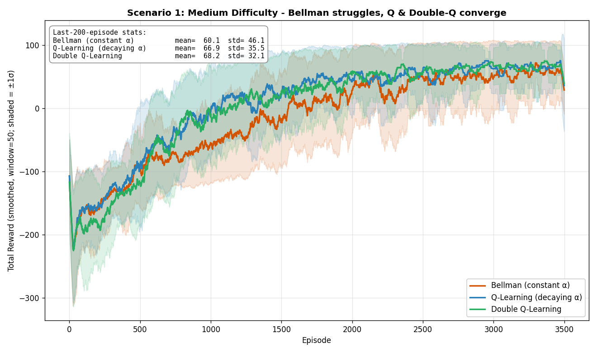
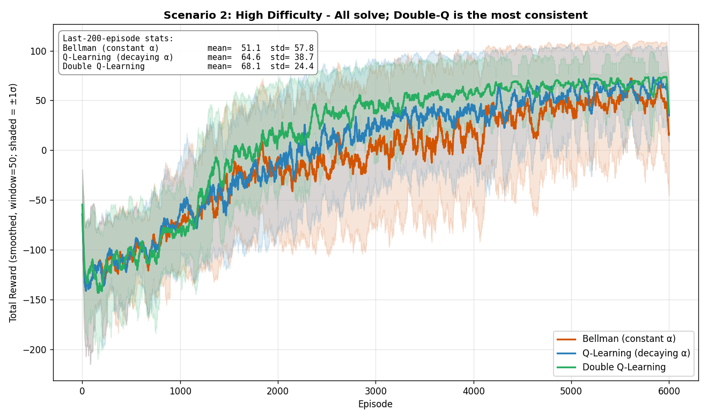

# DroneRL — Smart City Drone Delivery

An educational reinforcement learning lab that compares **three tabular RL algorithms** — Bellman (constant α), Q-Learning (decaying α), and Double Q-Learning (dual tables) — on a configurable smart-city drone delivery task. Built with Python + Pygame.

> Bar-Ilan University, Vibe Coding Workshop — Assignment 2

---

## Objectives

1. Implement **three RL algorithms** sharing the same `BaseAgent` interface so they can be swapped at runtime.
2. Build a **dynamic, randomizable board** with sliders that let the user shape the noise / density / difficulty of the environment.
3. Demonstrate, with **comparison graphs**, where each algorithm shines and where it breaks.
4. Keep every Python file ≤ 150 lines, ≥ 85 % test coverage, zero ruff violations, and all parameters in `config/config.yaml`.

---

## What Was Implemented

| Layer | Modules |
|-------|---------|
| **Agents** (Strategy pattern) | [`base_agent.py`](src/base_agent.py), [`agent.py`](src/agent.py) (Bellman), [`q_agent.py`](src/q_agent.py), [`double_q_agent.py`](src/double_q_agent.py), [`agent_factory.py`](src/agent_factory.py) |
| **Dynamic board** | [`environment.py`](src/environment.py) (added `CellType.PIT`), [`hazard_generator.py`](src/hazard_generator.py), [`sliders.py`](src/sliders.py) |
| **Comparison system** | [`comparison.py`](src/comparison.py) (matplotlib charts), `SDK.run_comparison()`, [`scripts/generate_comparison_charts.py`](scripts/generate_comparison_charts.py) |
| **GUI integration** | Algorithm switching via keys 1/2/3, hazard regeneration via G, live status bar |

---

## Installation

Requires **Python 3.11–3.13** and **UV**.

```bash
curl -LsSf https://astral.sh/uv/install.sh | sh
git clone https://github.com/adirelm/DroneRL-SmartCityDroneDelivery.git
cd DroneRL-SmartCityDroneDelivery
git checkout assignment-2
uv sync --dev
```

## Running

```bash
uv run main.py
```

To regenerate the convergence comparison charts:
```bash
uv run python scripts/generate_comparison_charts.py
```

---

## Keyboard Controls

| Key | Action |
|-----|--------|
| `SPACE` | Pause / Resume training |
| `F` | Toggle fast mode |
| `H` | Toggle Q-value heatmap |
| `A` | Toggle policy arrows |
| `E` | Toggle level editor |
| `T` | Cycle editor obstacle (Building / Trap / Wind / Pit) |
| `G` | Regenerate random hazards (uses sliders) |
| `1` | Switch to **Bellman** agent |
| `2` | Switch to **Q-Learning** agent |
| `3` | Switch to **Double Q-Learning** agent |
| `S` / `L` | Save / Load Q-table |
| `R` | Hard reset (clears training) |

---

## Algorithm Comparison

### Scenario 1 — Medium difficulty (noisy environment)



**Setup**: 12×12 grid, noise=0.5, density=0.12, difficulty=0.3, 3,500 episodes, seed=11. Bellman lr=0.7 (amplifies instability to make the effect visible).

| Algorithm | mean reward (last 200) | σ (last 200) |
|-----------|------------------------|--------------|
| Bellman (constant α=0.7) | 60.1 | 46.1 |
| Q-Learning (decaying α) | 66.9 | 35.5 |
| **Double Q-Learning** | **68.2** | **32.1** |

**Reading the graph:** all three curves rise together during exploration, then separate around episode 1,500. Bellman (orange) stays lowest and has the widest shaded band — the constant α keeps over-correcting on stochastic returns, so the Q-values never settle. Q-Learning's decaying α shrinks each step's impact and its band tightens. Double-Q's band is the tightest of the three because the cross-table evaluation removes the positive bias of `max Q(s', a)` — exactly the problem Hasselt (2010) identified.

### Scenario 2 — High difficulty (very noisy + denser hazards)



**Setup**: 12×12 grid, noise=0.7, density=0.15, difficulty=0.5, 6,000 episodes, seed=7. Q-Learning α_end=0.15 (floored high to show late-stage oscillation); Double-Q α_start=0.6 to compensate for its 50/50 table split.

| Algorithm | mean reward (last 200) | σ (last 200) |
|-----------|------------------------|--------------|
| Bellman | 51.1 | 57.8 |
| Q-Learning | 64.6 | 38.7 |
| **Double Q-Learning** | **68.1** | **24.4** |

**Reading the graph:** by episode 3,000 all three are "solving" the delivery task, but the σ column is where the story lives. Double-Q's shaded band is visibly the narrowest — **σ = 24** versus Q-Learning's **39** and Bellman's **58** — which is exactly the spec's "most consistent" claim in numbers. The 2× variance gap between Double-Q and Bellman in the last 200 episodes is the overestimation bias made visible.

---

## Conclusions

1. **Constant α (Bellman) is fundamentally limited in stochastic environments.** Watkins' convergence theorem requires Σα_t = ∞ AND Σα_t² < ∞ — a constant α fails the second. Empirically this shows up as a persistently wide σ band (46 in Scenario 1, 58 in Scenario 2) — the agent never settles because each update keeps yanking the value in the direction of the latest noisy return.
2. **Q-Learning's decaying α fixes the instability but inherits `max`-operator bias.** With the same value bootstrapped by `max_a Q(s', a)`, Jensen's inequality says `E[max] ≥ max[E]` — the target is systematically biased upward when returns are noisy. In Scenario 2 this shows as Q-Learning's σ=39 ending ~60 % higher than Double-Q's σ=24.
3. **Double Q-Learning removes the bias by decorrelating argmax and value.** One table picks the action, the other evaluates it. In both scenarios Double-Q ends with the **highest mean AND lowest variance** in the last 200 episodes — the signature of genuine unbiased convergence, not just "learned something fast".
4. **Environment shape matters more than hyper-parameters.** The same three algorithms behave qualitatively differently as the noise / density / difficulty sliders push the board into higher-variance regimes — a reminder that in RL, algorithm choice depends on the *environment's stochasticity*, not on a universal "best algorithm".

---

## Algorithms — Update Rules

**Bellman (constant α)** — Assignment 1 baseline. A single Q-table updated with a fixed learning rate; fast on static grids but over-reacts to noise.

$$Q(s,a) \leftarrow Q(s,a) + \alpha \left[ r + \gamma \max_{a'} Q(s',a') - Q(s,a) \right]$$

**Q-Learning (decaying α per episode)** — same update, but α shrinks geometrically each episode (floored at $\alpha_{\min}$) so value estimates settle in noisy environments.

$$Q(s,a) \leftarrow Q(s,a) + \alpha_t \left[ r + \gamma \max_{a'} Q(s',a') - Q(s,a) \right], \quad \alpha_{t+1} = \max(\alpha_{\min}, \alpha_t \cdot \alpha_{\text{decay}})$$

**Double Q-Learning (Hasselt 2010)** — two tables $Q_A, Q_B$; each step flips a coin and updates one using the other's value at the arg-max, removing the $\max$-operator overestimation bias.

$$\text{with prob. } \tfrac{1}{2}: Q_A(s,a) \leftarrow Q_A(s,a) + \alpha [r + \gamma Q_B(s', \arg\max_{a'} Q_A(s',a')) - Q_A(s,a)]$$

$$\text{otherwise}: Q_B(s,a) \leftarrow Q_B(s,a) + \alpha [r + \gamma Q_A(s', \arg\max_{a'} Q_B(s',a')) - Q_B(s,a)]$$

---

## Parameter Analysis

`config/config.yaml` exposes every tunable value. Most influential for differentiating the algorithms:

| Param | Effect |
|-------|--------|
| `agent.learning_rate` | Bellman's α (kept constant). Higher → faster learning but more instability under noise. |
| `q_learning.alpha_decay` / `double_q.alpha_decay` | Smaller value → faster decay → quicker stabilisation but less long-term plasticity. |
| `agent.epsilon_decay` | Slower decay → more exploration → safer but slower convergence. |
| `dynamic_board.noise_level` | Scales the wind drift probability. Above ~0.7 Bellman starts to break. |
| `dynamic_board.hazard_density` | Above ~0.25 paths to the goal become brittle and Q-Learning catches up to Double-Q. |
| `dynamic_board.difficulty` | Master multiplier; combines noise and density. |

---

## Project Structure

```
├── src/
│   ├── base_agent.py       # Abstract base for the 3 algorithms
│   ├── agent.py            # BellmanAgent (constant α)
│   ├── q_agent.py          # QLearningAgent (decaying α)
│   ├── double_q_agent.py   # DoubleQAgent (QA + QB tables)
│   ├── agent_factory.py    # Selects algorithm from config
│   ├── environment.py      # Smart-city grid + cell types (incl. PIT)
│   ├── hazard_generator.py # Random hazard placer driven by sliders
│   ├── sliders.py          # Pygame slider widgets
│   ├── trainer.py          # Episode-level training loop
│   ├── game_logic.py       # Step-level training, demo, convergence
│   ├── sdk.py              # Public API (train, switch_algorithm, run_comparison)
│   ├── comparison.py       # ComparisonStore + matplotlib chart
│   ├── gui.py              # Pygame orchestrator
│   ├── dashboard.py / buttons.py / overlays.py / renderer.py / editor.py
│   ├── actions.py / config_loader.py / logger.py
│   └── __init__.py
├── tests/                  # 187 pytest tests, 98%+ coverage
├── scripts/
│   └── generate_comparison_charts.py
├── config/config.yaml      # All parameters
├── data/comparison/        # Generated convergence PNGs
├── docs/
│   ├── assignment-1/       # PRD, PLAN, TODO from Assignment 1
│   ├── assignment-2/       # 3× PRD/PLAN/TODO for new features
│   └── shared/             # ARCHITECTURE.md, PROMPTS.md
├── main.py
├── pyproject.toml
└── CLAUDE.md               # Global coding standards (150-line cap, TDD, OOP, …)
```

---

## Running Tests

```bash
uv run pytest tests/ -v
uv run pytest tests/ --cov=src --cov-report=term-missing
uv run ruff check src/ tests/ main.py
```

Current state: **282 tests passing**, **98% coverage**, zero ruff violations.

---

## Tech Stack

- **Python 3.11–3.13** · **Pygame** (GUI) · **NumPy** (Q-tables, env)
- **PyYAML** (config) · **Matplotlib** (comparison charts)
- **Pytest** + **pytest-cov** · **Ruff** (lint) · **UV** (env / deps)

---

## Contributing

Follow the rules in [CLAUDE.md](CLAUDE.md):
- TDD — write the failing test first.
- Every file ≤ 150 lines; split by responsibility, not by layer.
- All tunables go to `config/config.yaml`. No magic numbers in source.
- `ruff check` must report zero issues before every commit.
- Maintain ≥ 85 % coverage.

---

## License & Credits

MIT License © 2026 Adir Elmakais.
Course material: Dr. Yoram Segal, *Vibe Coding Workshop*, Bar-Ilan University.
Algorithm references: Watkins (1989) for Q-Learning and Hado van Hasselt (2010) "Double Q-Learning" NeurIPS.
